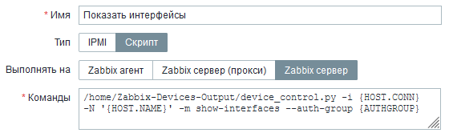

# Zabbix Devices Output

Скрипт для Zabbix, который позволяет автоматически выводить информацию сетевого оборудования
различных вендоров в удобном для чтения формате:

* Состояние интерфейсов;
* Системная информация;
* MAC-адреса на портах;
* Диагностика кабелей;
* VLAN на портах;
* Логи.


[Дополнительный модуль](https://github.com/ig-rudenko/find_description), 
для поиска строки в описании порта и отображения карты VLAN'ов


### Список поддерживаемых устройств и функционал

| VENDOR  | interfaces | MAC | sys-info | vlans | cable-diag | Logs|
| :----:|:----:|:---:|:----:|:----:|:----:|:---:|
| Cisco     | ✅ | ✅ | ✅ | ✅ | - | ✅
| Huawei    | ✅ | ✅ | ✅ | ✅ | ✅ | ✅
| D-Link    | ✅ | ✅ | ✅ | ✅ | ✅ | ✅
| Eltex     | ✅ | ✅ | ✅ | ✅ | - | -
| Edge-Core | ✅ | ✅ | ✅ | ✅ | - | -
| Extreme   | ✅ | ✅ | ✅ | ✅ | - | -
| Q-Tech    | ✅ | ✅ | ✅ | ✅ | - | -
| ZTE       | ✅ | ✅ | ✅ | ✅ | - | ✅
| ProCurve  | ✅ | - | ✅ | - | - | ✅
| Alcatel   | ✅ | - | - | - | - | -
| Lynksys   | ✅ | - | - | - | - | -
| Juniper   | ✅ | - | - | - | - | -


## Интеграция с Zabbix

Для работы скрипта, на сетевом оборудовании должен быть открыт `telnet` или `ssh` и создан пользователь
для подключения по удаленному терминалу

В файл `auth.yaml` добавляем новую группу авторизации `SomeGroup` в раздел `GROUPS`, 
где указываем требуемые логин и пароль пользователя 
```yaml
GROUPS:
  SomeGroup:
    login: admin
    password: password
    privilege_mode_password: enable
```
Добавляем макрос к узлу сети, который соответствует группе авторизации


Добавляем глобальный скрипт в Zabbix

    /home/Zabbix-Devices-Output/device_control.py -N '{HOST.NAME}' -i {HOST.CONN} -m show-interfaces --auth-group {$AUTH_GROUP} -P ssh

Указываем полный путь до скрипта, а в качестве переменных необходимые макросы

    -N (Имя устройства)
    -i (IP адрес)
    -m (Возвращаемые данные в данном случае `show-interfaces`)
    --auth-group (Имя группы авторизации)
    -P (Протокол подключения `ssh/telnet`. По умолчанию `telnet`)



###SNMP
Если необходимо собирать данные с помощью SNMP, то требуется указать следующую команду:


## Автоматический сбор данных

Чтобы автоматизировать процесс сбора данных, для начало необходимо добавить в базу данных `/db/database.db`
интересующие нас устройства


Обязательные для заполнения поля:
`IP, 
device_name,
auth_group,
default_protocol`


Воспользуемся следующей командой:

    /home/Zabbix-Devices-Output/device_control.py --zabbix-rebase Zabbix-group1 Zabbix-group2

Данная команда позволяет добавить в базу данных все узлы сети, которые находятся в указанных группах:
`Zabbix-group1`, `Zabbix-group2`.

**Указываем данные Zabbix-API в файле конфигурации!**

С помощью ключа `--data-gather` реализуем автоматический сбор данных `interfaces`,`sys-info` или `vlan` со всех устройств

    /home/Zabbix-Devices-Output/device_control.py --data-gather interfaces

Данные сохраняются в yaml-файл `/data/<device_name>/interfaces.yaml`:

```yaml
data:
- Admin Status: Enabled
  Description: 'Port 1'
  Interface: '1'
  Link: LinkDown
- Admin Status: Enabled
  Description: 'Port 2'
  Interface: '2'
  Link: LinkDown
- Admin Status: Enabled
  Description: 'Port 3'
  Interface: '3'
  Link: LinkDown
- Admin Status: Enabled
  Description: 'Port 4'
  Interface: '4'
saved time: 28 Aug 2021, 03:00:23
```

## Find-Description

После того как данные интерфейсов собраны, с помощью скрипта `find_description.py`
можно осуществлять поиск по описанию портов, которые хранятся в файлах `/data/<device_name>/interfaces.yaml`

    /home/Zabbix-Devices-Output/find_description.py -d CORM


    -d   Строгий поиск по слову (не зависит от регистра)
    -re  Поиск по регулярному выражению
    -m   Тип отображения данных
        device - только узлел сети и номер порта
        brief (по умолчанию) - узел сети, номер порта и его описание
        full - узел сети, номер порта, описание и admin status


## Vlan-Traceroute

После того как данные vlan'ов собраны, с помощью скрипта `vlan_traceroute.py`
можно осуществлять трассировку vlan'ов, которые хранятся в файлах `/data/<device_name>/vlan.yaml`

    /home/Zabbix-Devices-Output/vlan_traceroute.py -v 12 -m full


    -v   VLAN
    -s   Имя устройства откуда начать трассировку
    -F   Регулярное выражение для поиска по описанию
    -m   Тип отображения данных
        brief (по умолчанию) - отображаются только узлы сети
        full - узел сети, номер порта, описание

**Для успешной трассировки vlan'ов, необходимо, чтобы в описании порта было указано 
имя следующего узла сети**

Иногда в описаниях портов может быть неполное имя узла сети, 
либо с небольшими синтаксическими отличиями. Для таких случаев существует файл 
`/vlan_traceroute/name_format.yaml`

В нем указывается слово, которое требуется заменить и на что

```yaml
Shevch: Shevchenko
Vakulench: Vakulenchuka
```

В файле `/vlan_traceroute/vlan_name.yaml` можно указать vlan и его описание
```yaml
412: corp
700: For users
100: management
```

## Рассмотрим работу скрипта

```python

from core.dc import DeviceConnect

session = DeviceConnect(ip='192.168.0.10', device_name='device')
```
- **ip** - обязательный параметр
- **device_name** - опциональный (по умолчанию пустая строка)

После создания экземпляра класса необходимо указать тип авторизации для устройства
##### 1. Авторизация по умолчанию
```python
session.set_authentication()
```
Если не передавать никакие аргументы, то будет произведена попытка авторизироваться как admin/admin
##### 2. Авторизация с помощью логина и пароля
```python
session.set_authentication(login='admin', password='password')
```
##### 3. Авторизация с помощью группы:
```python
session.set_authentication(mode='group', auth_file='./auth.yaml', auth_group='group_1')
```
- **mode** - указывает тип авторизации: group, default, mixed, auto (по умолчанию default)
- **auth_file** - путь к файлу с авторизацией (по умолчанию ./auth.yaml)
- **auth_group** - имя группы, которая находится в файле, указанном в параметре **auth_file** (указывается, если выбран mode='group')

##### 4. Авторизация вперемешку
```python
session.set_authentication(mode='mixed', auth_file='./auth.yaml')
```
Использует для авторизации несколько логинов и паролей, соответственно, и несколько попыток,
которые указаны в файле авторизации **auth_file** (по умолчанию ./auth.yaml) в разделе **MIXED**

Если необходимо использовать другие пары логин/пароль, котороые не указаны в файле, то можно явно передать их с помощью списка

```python
session.set_authentication(login=['admin', 'Admin'], password=['admin', 'password'])
```
Если длина списков различается, то обрезается по меньшему

##### 5. Автоматическая авторизация

```python
session.set_authentication(mode='auto')
```
В данном случае логин и пароль будут выбраны автоматически, если **ip** либо **device_name** принадлежат какой-либо группе в файле авторизации

### Файл auth.yaml

Файл авторизации имеет формат YAML

В нем имеются два раздела:
* **GROUPS** 

Необходим для определения пользовательских групп.
Каждая группа должна иметь логин и пароль. Если при авторизации указать группу, в которой они отсутствуют, 
то будут выбраны логин и пароль по умолчанию (admin, admin)

В разделе **devices_by_ip** необходимо указать IP адреса устройств, к которым будет применяться правило выбора 
логина/пароля при указании автоматической авторизации.
Также возможно автоопределять группу по имени устройства в разделе **devices_by_name**

Можно указывать диапазоны IP адресов используя следующие конструкции:

    192.168.1.0/24   или    192.168.1.32/24

    192.168.1.1             192.168.1.1
    192.168.1.2             192.168.1.2
    ...                     ...
    192.168.1.253           192.168.1.253
    192.168.1.254           192.168.1.254
---
    192.168.1.1-100:    или     192.168.1-3.1-100:

    192.168.1.1                 192.168.1.1
    192.168.1.2                 192.168.1.2
    ...                         ...
    192.168.1.99                192.168.1.100
    192.168.1.100               192.168.2.1
                                ...
                                192.168.2.100
                                192.168.3.1
                                ...
                                192.168.3.100
* **MIXED**

Данный раздел содержит в себе несколько логинов и паролей для авторизации вперемешку

```yaml
GROUPS:
  group_1:
    login: Cisco
    password: Cisco
    privilege_mode_password: enable
    devices_by_ip:
      - 192.168.1.0/24
      - 192.168.2.1-100
      - 192.168.3-4.222
    devices_by_name:
      - device_1
      - device_2
      - device_3

MIXED:
    login:
      - admin
      - Admin
      - administrator
    password:
      - admin
      - password
      - 12345678
```

##### Далее подключаемся к оборудованию

```python
session.connect(protocol='ssh')
```
При успешном подключении возвращает **True**, в случае неудачи **False**
#### Пример работы программы
    

    $ device-control -N device_name -i 192.168.1.10 -m show-interfaces
        
        Подключаемся к device_name (192.168.1.10)
    
        Тип оборудования: Cisco
    
    ╒═════════════╤═════════════╤═════════════╕
    │ Interface   │ Status      │ Description │
    ╞═════════════╪═════════════╪═════════════╡
    │ Gi0/1       │ admin down  │             │
    ├─────────────┼─────────────┼─────────────┤
    │ Gi0/2       │ admin down  │             │
    ├─────────────┼─────────────┼─────────────┤
    │ Gi0/3       │ admin down  │             │
    ├─────────────┼─────────────┼─────────────┤
    │ Gi0/4       │ up          │ Printer_HP1 │
    ├─────────────┼─────────────┼─────────────┤
    │ Gi0/5       │ admin down  │             │
    ╘═════════════╧═════════════╧═════════════╛

